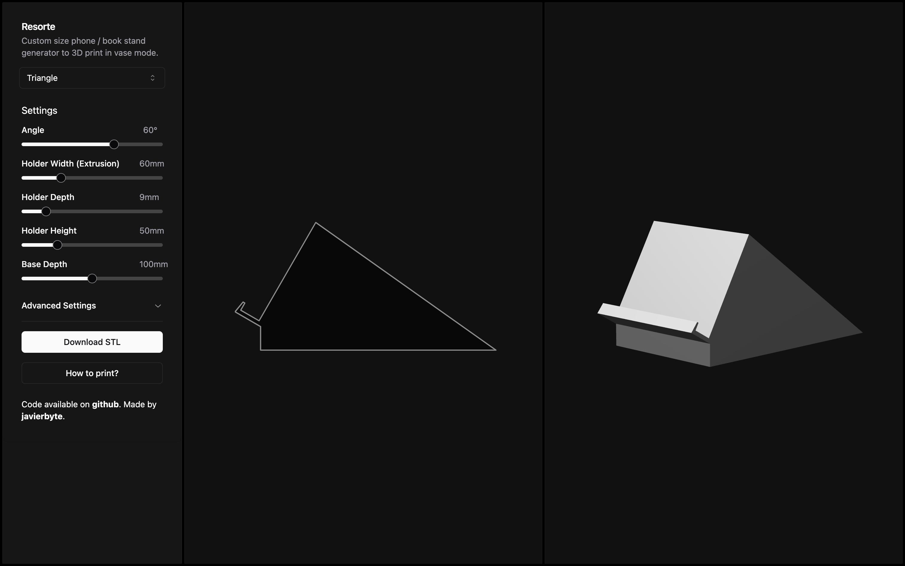
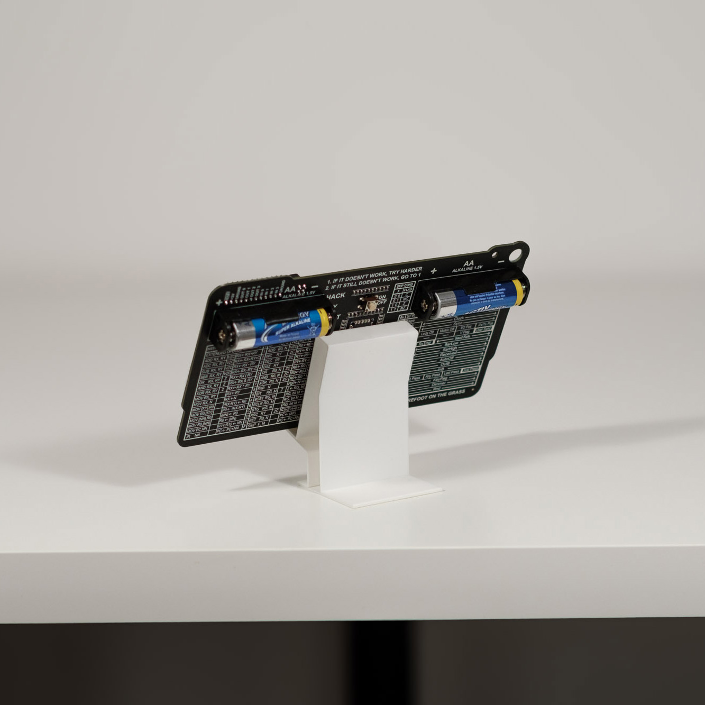
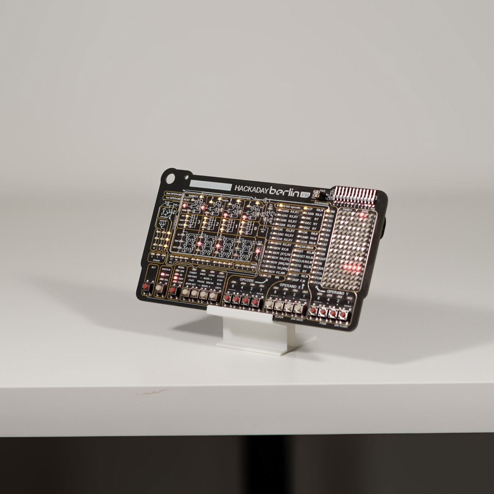
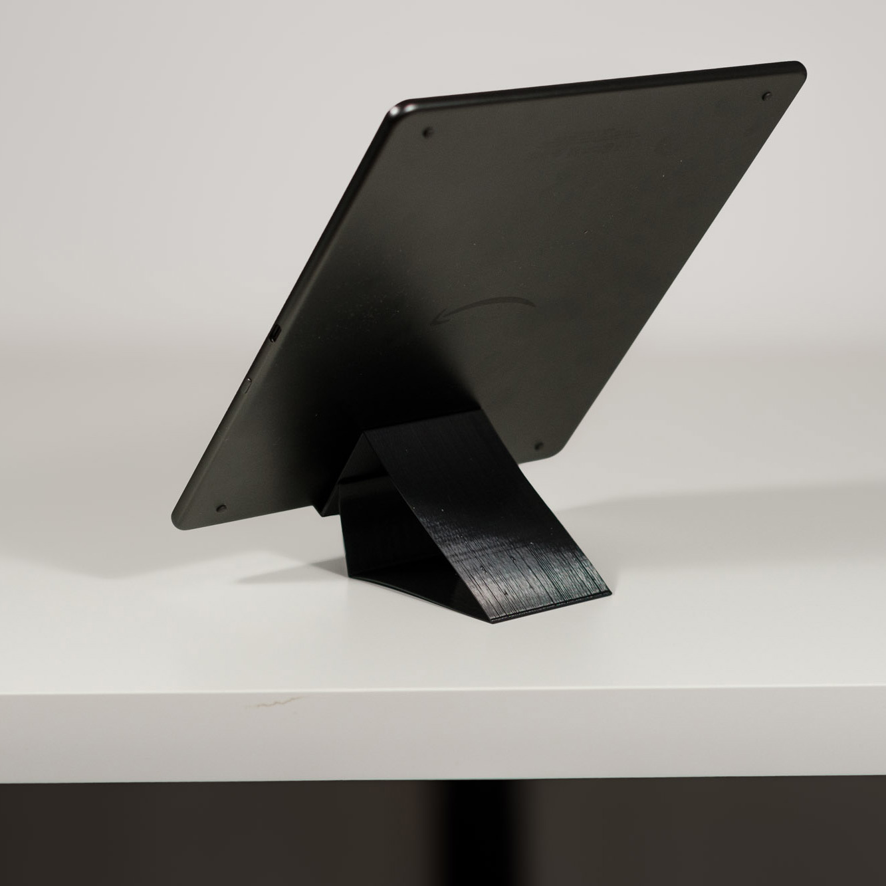
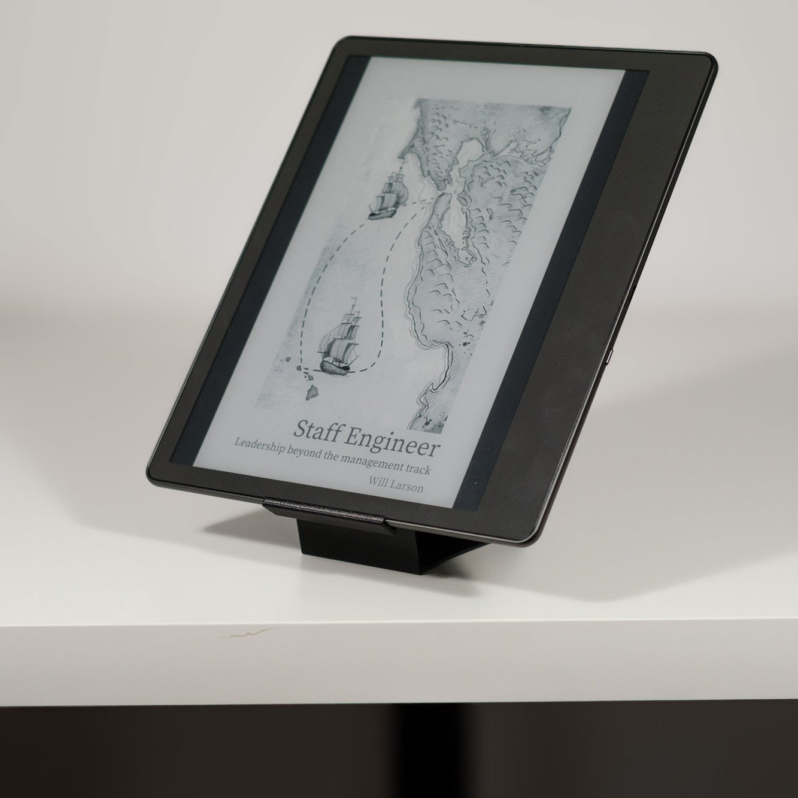
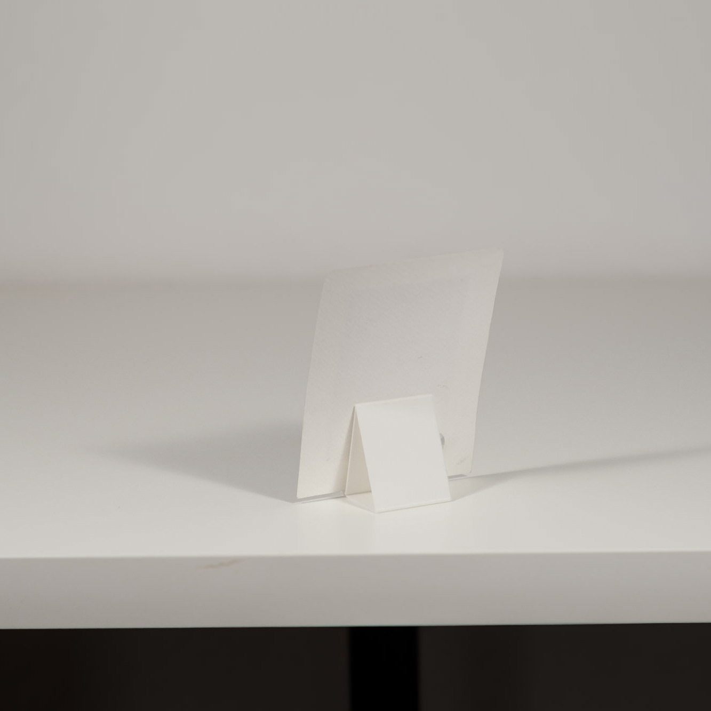
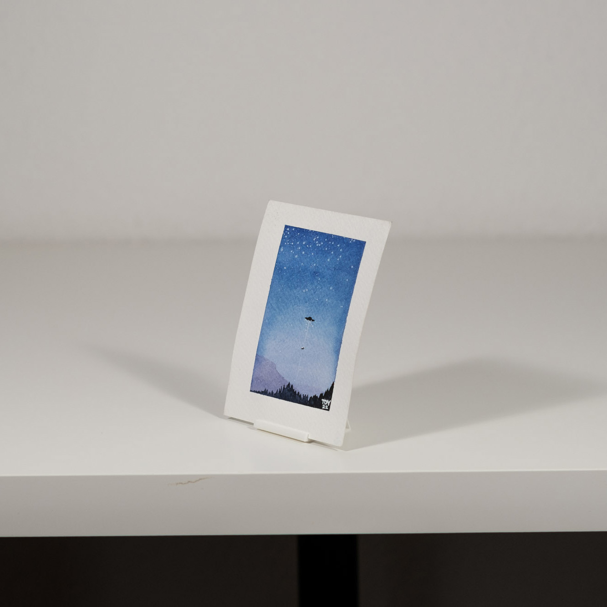
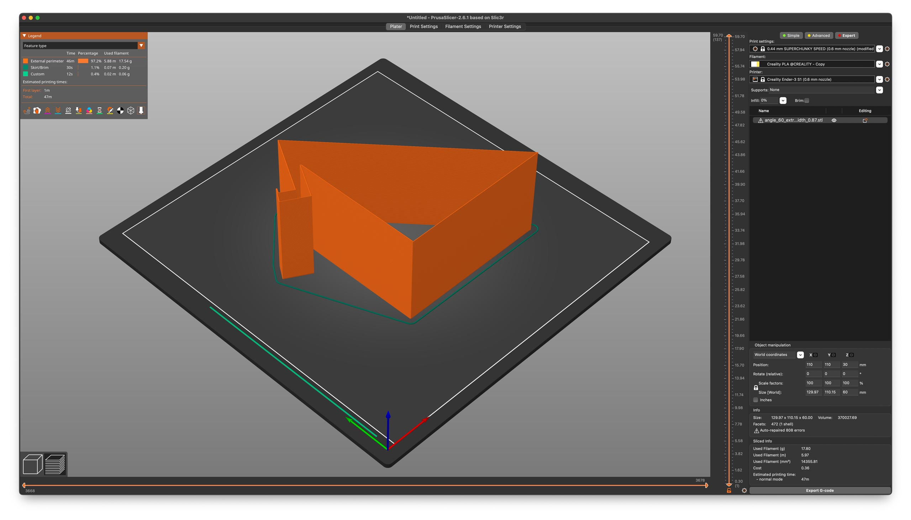

# [Resorte](https://javier.xyz/resorte)

Custom size phone / book stand generator to 3D print in vase mode.

[](https://javier.xyz/resorte)

## Made with resorte

|  |  |
| -------------------------------- | --------------------------------- |
|  |  |
|   |   |

## How to use and print

Configure your slicer to print in Vase Mode. In PrusaSlicer this
is called Spiral Vase. You can activate in Print Settings → Layers
and perimeters → Spiral vase.

**Print tips**

- Set the extrusion width to the nozzle width you entered (default `0.6mm`). Lips and floors are drawn exactly two lines thick, so the path going out and back fuses into one solid wall; the previews show the walls at that width.
- I remove the bottom layers, I prefer the look of the hollow parts.
- The exported .stl should have the correct size already, but you can verify its Z dimensions against the `extrude` value set when exported (also in the filename) to be sure.



## Working with the code

This is a [Next.js](https://nextjs.org/) project bootstrapped with [`create-next-app`](https://github.com/vercel/next.js/tree/canary/packages/create-next-app).

```bash
pnpm i
pnpm dev
```

Given that this project was setup to be mounted on `/resorte` on my website the run the project locally you have to go to `http://localhost:4827/resorte`.

### Adding a new design

Designs live in `src/components/designs/` and are registered in `index.ts`. A design is a `config` list of controls plus a `path` function that draws the side profile.

```ts
const config = [
  angleControl, // shared controls from shared.ts: angle, stand width, tolerance, nozzle
  widthControl,
  {
    key: "back",
    label: "Back height",
    min: 10,
    max: 180,
    suffix: "mm",
    default: 50,
    // Optional: size this control from the container (and the other params).
    // Return null when it can't be derived; the Auto toggle is hidden then.
    auto: (container) => (container.height ? container.height * 0.618 : null),
  },
  [...]
] as const;

// `params` has every `key` in config as a number. `container` has the
// thickness (always), and width / height (or null).
const path: PathFunction<typeof config> = (params, container) => {
  return {
    shape, // MultiPolygon, the profile
    seat: { origin, angle }, // where the container's bottom/back corner rests
  };
};
```

The `width` control is the extrusion depth (the print height in vase mode). The `seat` is used to draw the container in both previews and to run the balance check.

Thin parts should be `solidWall(params.nozzle)` thick (two lines, from `src/lib/vase.ts`): thinner over-extrudes, thicker leaves a gap between the lines. Round the outside of a bend in a thin part around its inner corner (`sectorRing`) so it stays two lines thick; a square corner leaves a void.

## Dependencies

- [polygon-clipping](https://github.com/mfogel/polygon-clipping) to merge and handle polygons.
- [Next.js](https://github.com/vercel/next.js)
- [shadcn/ui](https://github.com/shadcn-ui/ui)
