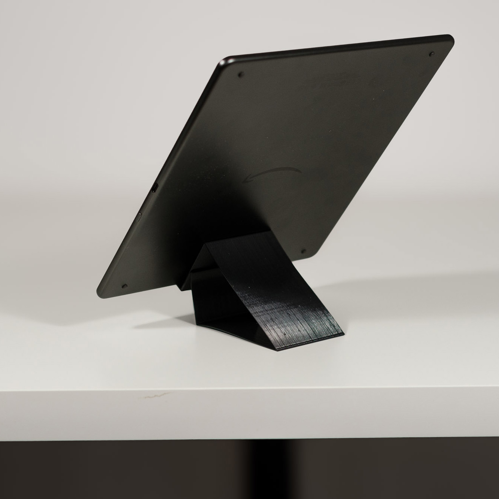

# [Resorte](https://javier.xyz/resorte)

Custom size phone / book stand generator to 3D print in vase mode.

[](https://javier.xyz/resorte)

## Made with resorte

|  |  |
| -------------------------------- | --------------------------------- |
|  |  |
|   |   |

## How to use and print

Configure your slicer to print in Vase Mode. In PrusaSlicer this
is called Spiral Vase. You can activate in Print Settings → Layers
and perimeters → Spiral vase.

**Print tips**

- Extrusion width to `0.9mm`. Since this is a single layer the ticker it is the better for this purpose. In any case, it seems that exceeding 1.5 your nozzle size is not recommended.
- I remove the bottom layers, I prefer the look of the hollow parts.
- The exported .stl should have the correct size already, but you can verify its Z dimensions against the `extrude` value set when exported (also in the filename) to be sure.


## Working with the code

This is a [Next.js](https://nextjs.org/) project bootstrapped with [`create-next-app`](https://github.com/vercel/next.js/tree/canary/packages/create-next-app).

```bash
pnpm i
pnpm dev
```

Given that this project was setup to be mounted on `/resorte` on my website the run the project locally you have to go to `http://localhost:3000`.

### Adding a new design

Designs are stored in `src/components/designs/`. Each design should export its configuration requirements and a path function that returns a `MultyPolygon`.

```
const config = [
  {
    key: "angle",
    label: "Angle",
    min: 0,
    max: 90,
    suffix: "°",
    default: 60,
    step: 1,
    advanced: false,
  },
  [...]
]

// params is an object with every `key` in config as a property with a `number`.
export function path(params) {
  // return MultiPolygon
}
```

## Dependencies

- [polygon-clipping](https://github.com/mfogel/polygon-clipping) to merge and handle polygons.
- [Next.js](https://github.com/vercel/next.js)
- [shadcn/ui](https://github.com/shadcn-ui/ui)
